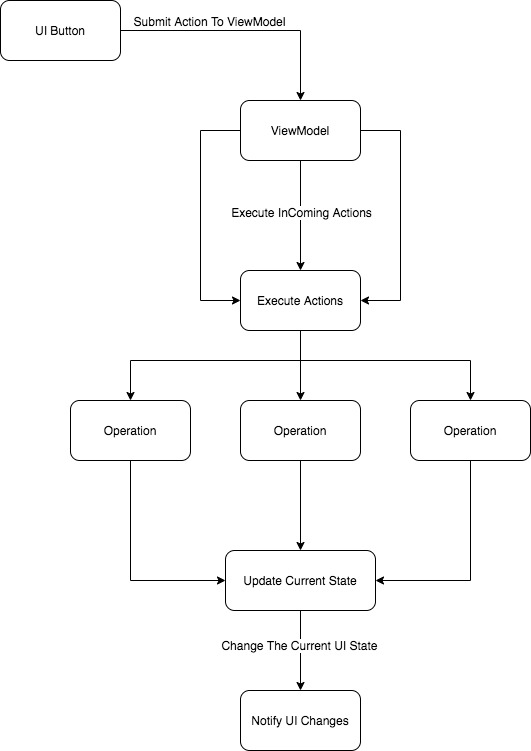

# Android Flow

The Android Structure is Not Just The Mvvm \(Common Architecture\) at this Time but the Vortex Architecture is Hybrid it means you can mix more than one to write clean code

Vortex State is The Important Part At The Structure because you always notify the View With The New State and Change The UI Depends on The InComing State Each of them will Described in Code Example 

**The Application Flow is** 

1. MVVM \(Model View ViewModel\)
2. Redux \(State handling\)
3. Clean Architecture \(Multi Modular Applications\)

## Vortex State Handling

