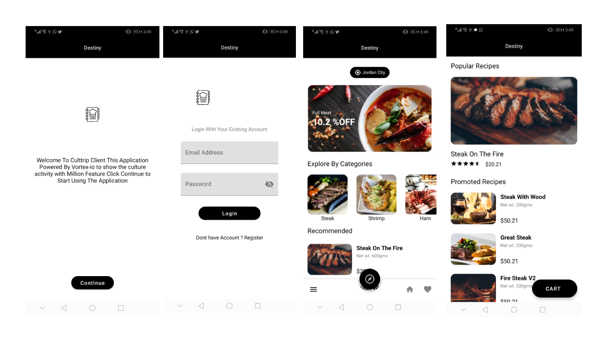
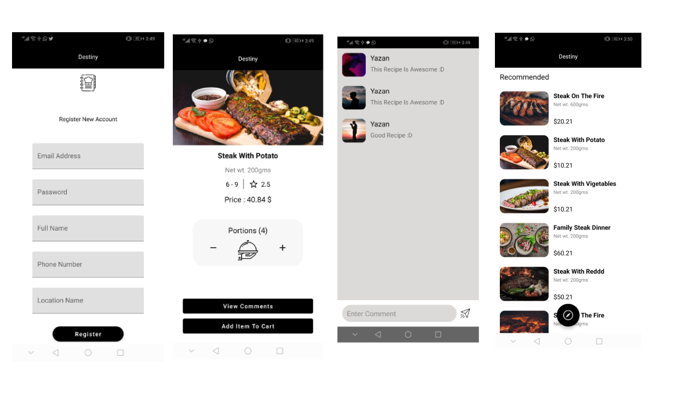

# Android Example

Android Example Application

You Can Find An Example On Github With The Following Link


[https://github.com/Yazan98/Destiny](https://github.com/Yazan98/Destiny)


The Application Components

1. Activities
2. Fragments
3. Navigation Components
4. Material Design
5. Realm Database
6. Multi Threading With Kotlin Courotines
7. Mvvm \(ViewModels\)
8. State Handlers
9. Retrofit For Api Requests
10. Shared Prefs
11. RxJava 2
12. Firebase Configuration
13. Work Manager
14. Firebase Messaging
15. Recycler View With Images Via Glide
16. Dependency Injection \(Koin, Motif\)

